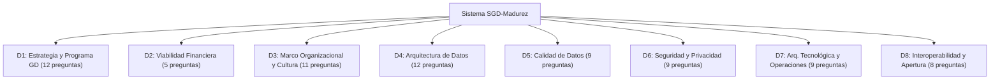
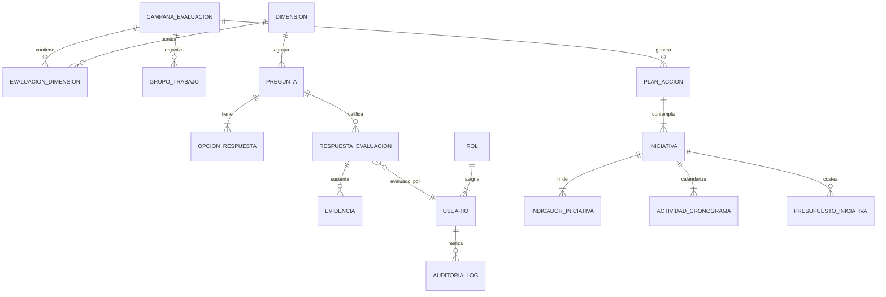
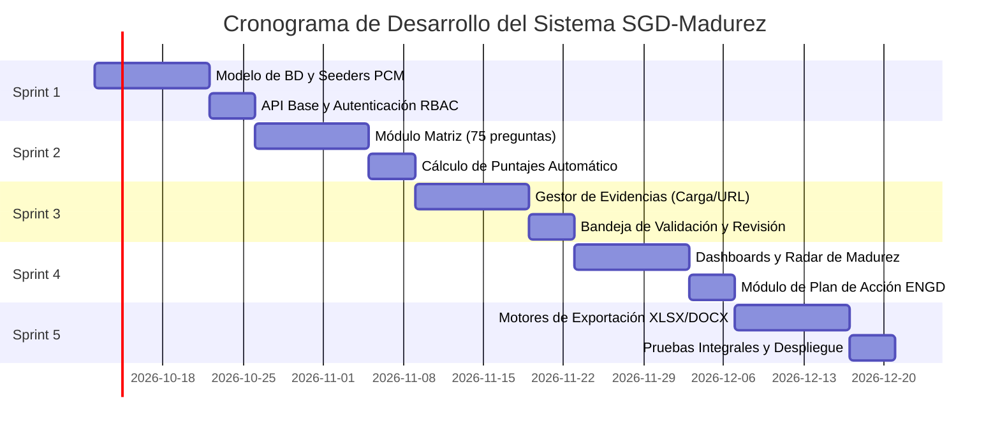

# SISTEMA INTEGRAL DE EVALUACIÓN DE MADUREZ Y GESTIÓN DEL PLAN DE ACCIÓN DE GOBIERNO DE DATOS
## Documento de Especificación de Requerimientos del Sistema (SRS), Arquitectura y Hoja de Ruta de Desarrollo
**Oficina de Tecnologías de la Información (OTI) | En cumplimiento de la Estrategia Nacional de Gobierno de Datos (ENGD) 2026–2030 (PCM / SGTD / CND)**

---

## 1. INTRODUCCIÓN Y PROPÓSITO

### 1.1. Contexto y Problema
En el marco de la transformación digital del Estado Peruano, las entidades públicas administran grandes volúmenes de datos que deben ser tratados como **activos estratégicos institucionales**. La Secretaría de Gobierno y Transformación Digital (**SGTD**) de la Presidencia del Consejo de Ministros (**PCM**), a través del Centro Nacional de Datos (**CND**), ha dispuesto el uso obligatorio de una metodología de evaluación de madurez en gobierno y gestión de datos.

Actualmente, este proceso se realiza de forma manual mediante:
- Múltiples hojas de cálculo complejas (`Matriz de Evaluación.xlsx`, `Inventario de evidencias.xlsx`).
- Formularios dispersos y carpetas compartidas sin trazabilidad de evidencias.
- Documentos de texto para el plan de acción (`Plan_Accion_GobDatos_PLANTILLA.docx`), que requieren transcripción y cálculo manual de métricas, brechas e indicadores.
- Dificultad para coordinar múltiples áreas usuarias, registrar evidencias auditables y consolidar informes para el Comité de Gobierno y Transformación Digital (**CGTD**) y la **PCM/CND**.

### 1.2. Propósito del Sistema
El presente documento define la especificación técnica, funcional y de arquitectura para desarrollar la plataforma web **"SGD-Madurez" (Sistema de Gobierno de Datos - Evaluación de Madurez y Plan de Acción)**.

El sistema permitirá:
1. Automatizar la aplicación de la **Matriz de Evaluación de Madurez de Gobierno de Datos (8 dimensiones, 75 preguntas)**.
2. Gestionar centralizadamente el **Inventario de Evidencias Digitales** con validación y auditoría de archivos.
3. Calcular en tiempo real los puntajes por dimensión y el **Puntaje Final de Madurez (0.00 a 5.00)**.
4. Generar **Dashboards analíticos** (Radar de madurez, comparativo de brechas, metas ENGD).
5. Automatizar la formulación, seguimiento y exportación oficial del **Plan de Acción de Gobierno de Datos** en formatos `.docx` y `.xlsx` compatibles con las plantillas de la PCM.
6. Facilitar el flujo colaborativo entre el **Patrocinador**, el **Oficial de Gobierno de Datos (OGD)**, los **Grupos de Trabajo / Áreas Orgánicas**, el **CGTD** y el **CND-PCM**.

---

## 2. MARCO NORMATIVO Y CONCEPTUAL

El sistema implementa directamente la base legal y metodológica vigente en el Perú:

| Norma / Instrumento | Denominación y Relevancia |
| :--- | :--- |
| **D.S. N° 085-2023-PCM** | Política Nacional de Transformación Digital al 2030 (PNTD). |
| **R.M. N° 049-2026-PCM** | Estrategia Nacional de Gobierno de Datos 2026–2030 (ENGD). |
| **D. Leg. N° 1412** | Ley de Gobierno Digital y su Reglamento. |
| **D.U. N° 006-2020** | Sistema Nacional de Transformación Digital. |
| **D.U. N° 007-2020** | Creación del Centro Nacional de Transformación Digital y Centro Nacional de Datos (CND). |
| **D.S. N° 029-2021-PCM** | Reglamento que aprueba el Marco de Gobernanza y Gestión de Datos del Estado Peruano. |
| **Guía de Evaluación PCM** | Guía y Modelo de Evaluación de Madurez de Gobierno de Datos para Entidades de la Administración Pública (SGTD / CND 2026). |

### 2.1. Escala Oficial de Madurez (0 a 5)
El sistema opera sobre la escala de seis niveles de madurez definida por la PCM:

```
[ Nivel 0 ] No Iniciado                     -> Sin conciencia, iniciativas ni procesos formales.
[ Nivel 1 ] Inicial / Ad-hoc                -> Gestión esporádica e informal, depende del esfuerzo individual.
[ Nivel 2 ] En Progreso / Parcial           -> Iniciativas en desarrollo con alcance limitado y sin aprobación plena.
[ Nivel 3 ] Definido / Implementado         -> Procesos formales, documentados y aprobados institucionalmente.
[ Nivel 4 ] Gestionado / Monitoreado        -> Procesos medidos con métricas cuantitativas, KPIs y supervisión continua.
[ Nivel 5 ] Optimizado / Integrado          -> Mejora continua, gobernanza proactiva e integración transversal del dato.
```

---

## 3. ARQUITECTURA DE LA INFORMACIÓN Y MODELO DE EVALUACIÓN

El modelo de evaluación se estructura en **8 dimensiones** y **75 preguntas** con ponderaciones uniformes:



### 3.1. Estructura de Dimensiones del Modelo

| Cód | Dimensión | N° Preguntas | Foco Estratégico y Propósito |
| :---: | :--- | :---: | :--- |
| **D1** | **Estrategia de Datos y Programa de Gestión de Datos (PGGD)** | 12 | El *“Por Qué”* y el *“Cómo”*. Evalúa la Estrategia de Gobierno de Datos (EGD), alineación con PEI/POI y PGD, gestión del dato como activo estratégico, toma de decisiones basada en datos, hoja de ruta, herramientas de gestión de proyectos y métricas de avance (KPI/KRI). |
| **D2** | **Viabilidad Financiera** | 5 | Gestión económica y sostenibilidad. Evalúa presupuesto específico asignado al PGGD, análisis costo-beneficio, optimización de costos mediante reutilización de datos y mecanismos para asegurar financiamiento continuo. |
| **D3** | **Marco Organizacional y Cultura de Datos** | 11 | El *“Quién”* y las *“Reglas”*. Estructura de gobernanza (roles formales: Oficial de Gobierno de Datos - OGD, Data Owners, Data Stewards, Custodios), Comités, programas de alfabetización de datos (Data Literacy), incentivos y gestión del cambio cultural. |
| **D4** | **Arquitectura de Datos** | 12 | El *“Qué”* y la documentación del dato. Modelo de Referencia de Datos (MRD), Glosario Centralizado de Términos, Gestión de Datos Maestros (MDM), perfil mínimo de metadatos (SGTD), linaje de datos y estandarización de modelos conceptuales/lógicos/físicos. |
| **D5** | **Calidad de Datos** | 9 | Aptitud para el Uso (*“Fit for Purpose”*). Programa de Calidad de Datos (PCD), definición de dimensiones de calidad (exactitud, completitud, oportunidad, consistencia, validez), reglas de negocio, umbrales y monitoreo continuo sobre datos críticos. |
| **D6** | **Seguridad** | 9 | Protección, Privacidad y Riesgos Algorítmicos. Alineación con SGSI (ISO/IEC 27001), cumplimiento de la Ley de Protección de Datos Personales (LPDP), inventario de bancos de datos personales, privacidad desde el diseño, clasificación de datos y anonimización/desidentificación. |
| **D7** | **Arquitectura Tecnológica y Operaciones** | 9 | Soporte tecnológico e infraestructura del dato. Infraestructura tecnológica para el PGGD, ciclo de vida del dato (almacenamiento, pipelines ETL/ELT, Data Lakes, Data Warehouse), Plan de Continuidad Operativa (PCO) y Recuperación ante Desastres (PDR), analítica avanzada. |
| **D8** | **Interoperabilidad y Apertura de Datos** | 8 | Intercambio y transparencia externa. Servicios de intercambio interoperables (Plataforma PIDE, GEOPERÚ), principios FAIR (Findable, Accessible, Interoperable, Reusable), catálogos de APIs y publicación sistemática en la Plataforma Nacional de Datos Abiertos (PNDA). |
| **TOTAL** | **8 Dimensiones** | **75 Preguntas** | **Escala de evaluación de 0.00 a 5.00 puntos** |

---

## 4. ACTORES DEL SISTEMA Y MATRIZ DE ROLES (RBAC)

De acuerdo con la Guía de Evaluación PCM, se definen los siguientes roles y permisos en el sistema:

| Rol del Sistema | Actor Institucional | Responsabilidades y Permisos |
| :--- | :--- | :--- |
| **Administrador del Sistema** | OTI - Especialista TI / Soporte | Gestión de usuarios, configuración general del sistema, auditoría de accesos, respaldos y parametrización de catálogos. |
| **Líder de la Evaluación / OGD** | Oficial de Gobierno de Datos (OGD) | Control total del ciclo de evaluación: configuración del alcance, asignación de preguntas a grupos de trabajo, revisión y consolidación de respuestas, formulación del Plan de Acción, generación de reportes oficiales. |
| **Patrocinador / Alta Dirección** | Titular de la Entidad / SG / Gerencia General | Consulta ejecutiva de dashboards, visualización de estado de madurez, aprobación institucional de informes y firma del Plan de Acción. |
| **Comité de Gobierno Digital (CGTD)** | Miembros del CGTD | Revisión colegiada de resultados, validación del diagnóstico y aprobación formal mediante resolución o acta del Plan de Acción de Gobierno de Datos. |
| **Grupo de Trabajo / Proveedor** | Responsables de Áreas Orgánicas, TI, BD, Planeamiento, Legal, etc. | Responder las preguntas asignadas según su competencia, adjuntar evidencias sustentatorias requeridas, registrar comentarios y justificaciones técnicas. |
| **Evaluador Interno / Revisor** | Equipo OTI / Especialistas de Madurez | Validación de coherencia entre respuestas seleccionadas y las evidencias adjuntadas; aprobación u observación de evidencias. |
| **Auditor / Enlace CND-PCM** | Centro Nacional de Datos (SGTD - PCM) | Acceso de supervisión/lectura para revisión técnica del diagnóstico, validación de evidencias y aprobación del informe oficial de madurez previo a su registro nacional. |

---

## 5. MÓDULOS FUNCIONALES DEL SISTEMA

### 5.1. Módulo 1: Gestión de Campañas y Fases de Evaluación
Permite gestionar el ciclo de vida continuo de las evaluaciones de madurez institucionales (período anual o reevaluación cada 1.5 años):
- Creación de campañas de evaluación (Ej.: *"Evaluación de Madurez de Gobierno de Datos 2026"*).
- Flujo secuencial de las **8 Fases Metodológicas oficiales**:
  1. *Fase 1: Conformación de Equipos* (Registro de Patrocinador, OGD, Grupos de Trabajo).
  2. *Fase 2: Definición de Objetivos y Alcance* (Vinculación con OEI del PEI y metas del PGD).
  3. *Fase 3: Planificación de Actividades* (Cronograma de entrevistas, capacitaciones y fechas límite).
  4. *Fase 4: Kick-Off* (Registro de acta y participantes de la reunión inicial).
  5. *Fase 5: Diagnóstico del Estado Actual* (Llenado colaborativo de la Matriz y Evidencias).
  6. *Fase 6: Consolidación y Validación* (Revisión consensual interna y validación CND-PCM).
  7. *Fase 7: Formulación del Plan de Acción* (Generación de iniciativas, metas y presupuesto).
  8. *Fase 8: Aprobación y Monitoreo Continuo* (Aprobación CGTD y seguimiento de ejecución).

### 5.2. Módulo 2: Matriz de Evaluación Digital (75 Preguntas)
Replica y potencia la plantilla `Matriz de Evaluación - SISTEMA.xlsx`:
- Visualización organizada por pestañas o navegación por dimensión (D1 a D8).
- Ficha detallada por pregunta:
  - Código oficial (ejemplo: `1.1`, `1.2`, ..., `8.8`).
  - Pregunta completa.
  - Explicación y objetivo de la pregunta.
  - Resultados esperados y ejemplos prácticos.
  - Selector de opciones (0: No iniciado a 5: Optimizado) con el texto descriptivo específico de cada nivel.
  - Campo obligatorio de **Comentarios y Justificación** técnica de la entidad.
  - Contador de evidencias mínimas asociadas.
- Algoritmo de cálculo automático de puntajes:
  $$\text{Puntaje Dimensión } D_k = \frac{1}{N_k} \sum_{i=1}^{N_k} \text{Valor}(Pregunta_{k,i})$$
  $$\text{Puntaje Final Institucional (PF)} = \frac{1}{8} \sum_{k=1}^{8} \text{Puntaje}(D_k)$$
- Bloqueo de preguntas evaluadas y control de versiones por si se requiere rectificación fundamentada.

### 5.3. Módulo 3: Repositorio e Inventario de Evidencias Digitales
Replica y estandariza la estructura del archivo `Inventario de evidencias.xlsx`:
- Campos de registro por evidencia:
  - **Código de Pregunta** vinculada (ej.: `1.1`, `4.5`).
  - **Pregunta vinculada**.
  - **Origen** (Interno / Externo / Normativo).
  - **Tipo de Evidencia** (Documento normativo, Política, Manual, Acta de reunión, Reporte técnico, Repositorio Git, Arquitectura/Diagrama, Enlace a portal).
  - **Nombre de la Evidencia** (título descriptivo).
  - **Ruta / Almacenamiento**: Subida directa de archivo (PDF, DOCX, XLSX, PNG, ZIP hasta 50MB) o URL externa segura (SharePoint, Drive institucional, portal oficial).
  - **Descripción del Contenido** (resumen ejecutivo de cómo la evidencia sustenta el nivel).
  - **Responsable** (Apellidos y Nombres, Cargo).
  - **Área / Unidad Orgánica**.
  - **Fecha de Registro**.
  - **Estado de Validación**: *Borrador*, *Enviado a Revisión*, *Validado*, *Observado con comentarios*.
- Búsqueda multifiltro por dimensión, tipo de evidencia, estado de validación y área orgánica.
- Previsualización integrada de documentos PDF e imágenes en la plataforma.

### 5.4. Módulo 4: Dashboard Ejecutivo y Análisis de Brechas
- **Radar de Madurez (Spider Chart)**: Muestra visual de las 8 dimensiones vs. el nivel esperado (Nivel 3: Definido, o meta fijada por la alta dirección).
- **Semáforo de Cumplimiento**:
  - Rojo: Nivel 0.00 – 1.49 (Crítico / No iniciado / Ad-hoc)
  - Amarillo: Nivel 1.50 – 2.99 (Medio / En progreso)
  - Verde: Nivel 3.00 – 5.00 (Aceptable / Definido / Optimizado)
- **Matriz Automática de Brechas**:
  $$\text{Brecha} = \text{Nivel Objetivo} - \text{Nivel Alcanzado}$$
- Ranking de dimensiones más críticas para priorización inmediata.

### 5.5. Módulo 5: Generador y Gestor del Plan de Acción (Plantilla PCM)
Implementa fielmente la estructura del documento oficial `Plan_Accion_GobDatos_PLANTILLA.docx`:
- **Sección I: Antecedentes**: Base legal precargada (PNTD, ENGD, D.Leg. 1412, etc.).
- **Sección II: Identificación General**: Datos de la entidad, datos del Oficial de Gobierno de Datos (OGD), miembros y resoluciones del CGTD.
- **Sección III: Enfoque Estratégico**: Vinculación con PEI/POI y alineación obligatoria con los **Ejes de la ENGD 2026–2030**:
  - *Eje 1: Gobernanza e Institucionalidad.*
  - *Eje 2: Infraestructura y Tecnologías de Datos.*
  - *Eje 3: Calidad e Interoperabilidad de Datos.*
  - *Eje 4: Cultura y Capacidades en Datos.*
  - *Eje 5: Uso Estratégico y Ético de los Datos.*
- **Sección IV: Diagnóstico y Brechas**: Auto-completado desde el Módulo de Evaluación (resumen ejecutivo, tablas de resultados por dimensión y oportunidades de mejora).
- **Sección V: Iniciativas, Indicadores y Metas**:
  - Definición de iniciativas priorizadas.
  - Indicadores de Desempeño (KPI) e Indicadores de Seguimiento (KRI).
  - Fórmulas de cálculo, periodicidad, línea base y meta anual.
  - Matriz consolidada de iniciativas con ponderaciones relativas (% peso) y cálculo de Índice de Cumplimiento Ponderado.
- **Sección VI: Cronograma, Responsables y Presupuesto**:
  - Cronograma de actividades (Gantt interactivo: Fecha inicio, Fecha fin, Hitos).
  - Asignación de unidades orgánicas y responsables principales.
  - Tabla de Costos y Financiamiento: Costo proyectado (S/), Costo ejecutado (S/), Fuente de financiamiento (RO, RDR, etc.) y recursos requeridos.
- **Sección VII: Anexos y Firmas**: Control de versiones y firmas digitales para OGD y Presidente del CGTD.

### 5.6. Módulo 6: Motor de Exportación Oficial e Interoperabilidad
- **Exportación a Excel (`.xlsx`)**: Genera exactamente la `Matriz de Evaluación.xlsx` y el `Inventario de evidencias.xlsx` con el formato, celdas y estilos oficiales exigidos para la entrega formal a la PCM.
- **Exportación a Word (`.docx`) y PDF**: Genera el documento completo del Plan de Acción institucional a partir de `Plan_Accion_GobDatos_PLANTILLA.docx` con todas las tablas completas, formateadas y listas para firma del CGTD.
- **API REST**: Endpoints seguros para eventual interoperabilidad con la plataforma central del CND / SGTD - PCM.

---

## 6. MODELO DE DATOS ENTIDAD-RELACIÓN (BD RELACIONAL)



### 6.1. Diccionario de Tablas Principales

#### 1. `dimensiones`
- `id`: INT (PK)
- `codigo`: VARCHAR(5) [D1, D2, ..., D8]
- `nombre`: VARCHAR(255)
- `descripcion`: TEXT
- `foco_estrategico`: VARCHAR(255)
- `orden`: INT

#### 2. `preguntas`
- `id`: INT (PK)
- `dimension_id`: INT (FK `dimensiones.id`)
- `codigo`: VARCHAR(10) [1.1, 1.2, ..., 8.8]
- `enunciado`: TEXT
- `explicacion`: TEXT
- `resultados_esperados`: TEXT
- `orden`: INT

#### 3. `opciones_respuesta`
- `id`: INT (PK)
- `pregunta_id`: INT (FK `preguntas.id`)
- `nivel`: INT [0, 1, 2, 3, 4, 5]
- `etiqueta`: VARCHAR(100) [No iniciado, Inicial, En progreso, etc.]
- `descripcion_criterio`: TEXT (texto exacto de la rúbrica oficial)

#### 4. `campanas_evaluacion`
- `id`: INT (PK)
- `titulo`: VARCHAR(255)
- `periodo`: VARCHAR(20) [Ej. "2026-I", "2026-2027"]
- `fecha_inicio`: DATE
- `fecha_cierre`: DATE
- `fase_actual`: INT [1 a 8]
- `estado`: VARCHAR(50) [En Planificación, En Diagnóstico, En Consolidación, Validado PCM, Cerrado]
- `puntaje_final_obtenido`: DECIMAL(4,2)

#### 5. `respuestas_evaluacion`
- `id`: INT (PK)
- `campana_id`: INT (FK `campanas_evaluacion.id`)
- `pregunta_id`: INT (FK `preguntas.id`)
- `opcion_id`: INT (FK `opciones_respuesta.id`)
- `valor_numerico`: DECIMAL(3,2) [0 a 5]
- `comentarios`: TEXT
- `usuario_evaluador_id`: INT (FK `usuarios.id`)
- `estado_revision`: VARCHAR(50) [Borrador, Enviado, Aprobado, Observado]
- `actualizado_en`: TIMESTAMP

#### 6. `evidencias`
- `id`: INT (PK)
- `respuesta_id`: INT (FK `respuestas_evaluacion.id`)
- `origen`: VARCHAR(100)
- `tipo_evidencia`: VARCHAR(100) [Documento, Política, Acta, Reporte, Enlace, Repositorio]
- `nombre_evidencia`: VARCHAR(255)
- `ruta_archivo_o_url`: TEXT
- `descripcion_contenido`: TEXT
- `responsable_nombre`: VARCHAR(200)
- `area_unidad`: VARCHAR(200)
- `fecha_registro`: DATE
- `estado_validacion`: VARCHAR(50) [Borrador, En Revisión, Validado, Observado]
- `comentario_evaluador`: TEXT

#### 7. `planes_accion`
- `id`: INT (PK)
- `campana_id`: INT (FK `campanas_evaluacion.id`)
- `entidad_nombre`: VARCHAR(255)
- `entidad_siglas`: VARCHAR(50)
- `ogd_nombre`: VARCHAR(200)
- `ogd_puesto`: VARCHAR(200)
- `resolucion_aprobacion`: VARCHAR(100)
- `estado`: VARCHAR(50) [Formulación, En Revisión CGTD, Aprobado CGTD, Enviado CND]

#### 8. `iniciativas_plan`
- `id`: INT (PK)
- `plan_id`: INT (FK `planes_accion.id`)
- `codigo`: VARCHAR(20) [INIC-01, INIC-02]
- `nombre`: VARCHAR(255)
- `descripcion`: TEXT
- `eje_engd`: VARCHAR(100)
- `plazo`: VARCHAR(50) [Corto plazo, Mediano plazo, Largo plazo]
- `peso_relativo`: DECIMAL(5,2) [%]
- `porcentaje_meta`: DECIMAL(5,2)
- `porcentaje_avance_real`: DECIMAL(5,2)
- `responsable_nombre`: VARCHAR(200)
- `unidad_organica`: VARCHAR(200)
- `costo_proyectado`: DECIMAL(12,2)
- `costo_ejecutado`: DECIMAL(12,2)
- `fuente_financiamiento`: VARCHAR(100)
- `fecha_inicio`: DATE
- `fecha_fin`: DATE

---

## 7. ARQUITECTURA TÉCNICA Y STACK TECNOLÓGICO RECOMENDADO

Considerando las tecnologías disponibles en la infraestructura de la OTI y las mejores prácticas de desarrollo web moderno:

### 7.1. Stack Tecnológico

```
[ FRONTEND ]
- Core: React 18+ o Next.js 14+ con TypeScript
- UI & Estilos: Vanilla CSS moderno / CSS Modules (diseño premium, responsivo, tokens de diseño)
- Componentes Visuales: Lucide React Icons
- Gráficos y Dashboards: Chart.js / ApexCharts (Gráfico de Radar, Barras de Brechas, Gantt)

[ BACKEND / API ]
- Lenguaje / Runtime: Python 3.12+ / 3.14 (ya validado en el entorno de trabajo)
- Framework Web: FastAPI (alto rendimiento, documentación Swagger OpenAPI automática, tipado Pydantic)
- ORM / Persistencia: SQLAlchemy 2.0 + Alembic (migraciones)
- Procesamiento de Archivos:
  * python-docx: Manipulación y generación de planes de acción (.docx)
  * openpyxl: Importación/exportación de matrices (.xlsx)
  * pypdf / ReportLab: Generación y visor de reportes PDF oficiales

[ BASE DE DATOS ]
- Producción: PostgreSQL 15+ / MySQL 8+
- Desarrollo local / Pruebas: SQLite (cero configuración inicial)

[ SEGURIDAD & AUTENTICACIÓN ]
- JWT (JSON Web Tokens) con refresh token
- Hashing seguro: passlib / bcrypt
- Compatible con autenticación centralizada (Active Directory / LDAP institucional de la entidad)
```

### 7.2. Diagrama de Arquitectura de la Solución

```
+--------------------------------------------------------------------------+
|                        CAPA DE PRESENTACIÓN (CLIENTE)                    |
|  - SPA / Web Responsive (Inter / Outfit Typography, Modern Dark/Light)   |
|  - Módulo Diagnóstico (75 Preguntas)  - Tablero Radar y Semáforos        |
|  - Gestor de Evidencias               - Plan de Acción y Cronograma      |
+--------------------------------------------------------------------------+
                                     |  HTTP REST / JSON / Multipart
                                     v
+--------------------------------------------------------------------------+
|                        CAPA DE APLICACIÓN (FASTAPI)                      |
|  - Controladores REST (/api/v1/evaluaciones, /api/v1/evidencias, ...)    |
|  - Motor de Cálculo de Madurez y Reglas Metodológicas PCM                |
|  - Servicio de Documentos: Generadores OpenPyXL y Python-Docx           |
|  - Seguridad, Roles y Middleware de Auditoría                            |
+--------------------------------------------------------------------------+
                  |                                        |
                  v                                        v
+------------------------------------+   +---------------------------------+
|   BASE DE DATOS RELACIONAL         |   |    ALMACENAMIENTO DE ARCHIVOS   |
|  (PostgreSQL / SQLite)             |   |  - Repositorio Evidencias (PDF) |
|  - Dimensiones, Preguntas, Rúbricas|   |  - Plantillas Oficiales Word/Xls|
|  - Evaluaciones, Evidencias, Planes|   |  - Informes Consolidados        |
+------------------------------------+   +---------------------------------+
```

---

## 8. REQUERIMIENTOS FUNCIONALES DETALLADOS (RF)

| ID | Nombre | Descripción | Prioridad |
| :--- | :--- | :--- | :---: |
| **RF-01** | Catálogo del Modelo | Precargar las 8 dimensiones oficiales, 75 preguntas y 450 opciones de escala (0 a 5) con textos de la guía PCM. | Alta |
| **RF-02** | Creación de Campaña | Crear y configurar períodos de evaluación con fechas, objetivos SMART y asignación de equipo. | Alta |
| **RF-03** | Asignación por Áreas | Asignar preguntas específicas a grupos de trabajo de distintas direcciones o unidades orgánicas. | Alta |
| **RF-04** | Evaluación Interactiva | Permitir marcar la opción alcanzada con cálculo visual de puntaje e ingreso de justificación técnica. | Alta |
| **RF-05** | Carga de Evidencias | Subir archivos o enlazar URLs que sustenten la respuesta según el formato de 10 campos oficial. | Alta |
| **RF-06** | Validación de Evidencias | Bandeja del OGD/Evaluador para aprobar, comentar u observar evidencias sustentatorias. | Alta |
| **RF-07** | Cálculo en Tiempo Real | Calcular promedio por dimensión y Puntaje Final (PF) institucional con redondeo a 2 decimales. | Alta |
| **RF-08** | Radar de Madurez | Renderizar gráfico de telaraña interactivo comparando las 8 dimensiones vs. nivel meta. | Media |
| **RF-09** | Matriz de Brechas | Tabular automáticamente las diferencias entre nivel actual y objetivo, sugiriendo acciones. | Media |
| **RF-10** | Formulación Plan Acción | Crear iniciativas alineadas a los 5 ejes ENGD con indicadores KPI/KRI, responsables y fechas. | Alta |
| **RF-11** | Presupuesto y Costos | Registrar y consolidar costos proyectados vs. ejecutados por iniciativa y fuente presupuestal. | Media |
| **RF-12** | Exportador Excel (.xlsx) | Generar archivo idéntico a `Matriz de Evaluación - SISTEMA.xlsx` y `Inventario de evidencias.xlsx`. | Alta |
| **RF-13** | Exportador Word (.docx) | Generar documento oficial idéntico a `Plan_Accion_GobDatos_PLANTILLA.docx` con datos inyectados. | Alta |
| **RF-14** | Auditoría y Trazabilidad | Registro inmutable de cada cambio de respuesta, subida de evidencia y acción de usuarios. | Media |

---

## 9. REQUERIMIENTOS NO FUNCIONALES (RNF)

1. **Seguridad y Privacidad**:
   - Protección contra inyección SQL, Cross-Site Scripting (XSS) y CSRF.
   - Restricción de formatos de subida de archivos y sanitización de nombres de archivo.
   - Cumplimiento de la Ley N° 29733 (Ley de Protección de Datos Personales).
2. **Rendimiento**:
   - Tiempo de respuesta de endpoints menor a 300 ms en consultas estándar.
   - Generación de reportes completos `.docx` y `.xlsx` en menos de 3 segundos.
3. **Disponibilidad y Confiabilidad**:
   - Disponibilidad proyectada del 99.5% en entorno institucional.
   - Respaldo automático diario de base de datos y volumen de evidencias.
4. **Diseño y Usabilidad (UX/UI)**:
   - Interfaz limpia, moderna, con paleta de colores institucional, modo claro/oscuro armónico.
   - Diseño adaptable (*responsive*) para computadoras de escritorio y tablets.
   - Tipografía moderna (ejemplo: Inter o Roboto) e iconografía intuitiva.
5. **Portabilidad y Mantenibilidad**:
   - Despliegue contenerizado mediante `Docker` y `docker-compose`.
   - Código modular documentado bajo estándares PEP-8 (Backend) y ESLint/TypeScript (Frontend).

---

## 10. HOJA DE RUTA Y PLAN DE IMPLEMENTACIÓN POR SPRINTS

El desarrollo se organiza en un ciclo ágil de **5 Sprints** (2 semanas por sprint):



### Detalle de los Sprints:
- **Sprint 1 (Fundamentos y Catálogo Metodológico)**:
  - Diseño del esquema de base de datos relacional.
  - Script seed de migración automática de las 8 dimensiones, 75 preguntas y 450 opciones desde `Matriz de Evaluación - SISTEMA.xlsx`.
  - Módulo de autenticación y asignación de roles.
- **Sprint 2 (Matriz de Diagnóstico y Evaluación)**:
  - Interfaz de navegación de la matriz de evaluación.
  - Asignación de preguntas a grupos de trabajo por área.
  - Formulario dinámico con rúbricas explicativas y cálculo automático de fórmulas.
- **Sprint 3 (Inventario de Evidencias Digitales)**:
  - Sistema de almacenamiento y carga de archivos / enlaces.
  - Módulo de validación de evidencias (estados: observado, validado).
  - Trazabilidad y auditoría.
- **Sprint 4 (Analítica de Brechas y Plan de Acción)**:
  - Visualización gráfica (Radar, semáforo, tabla de brechas).
  - Módulo web para completar las iniciativas, cronogramas y presupuesto del Plan de Acción.
- **Sprint 5 (Motores de Exportación Office y Puesta en Producción)**:
  - Implementación de plantillas dinámicas con `openpyxl` y `python-docx` para descarga en 1-click.
  - Pruebas unitarias y de integración.
  - Empaquetado Docker y manual de usuario.

---

## 11. ESTRUCTURA RECOMENDADA DEL PROYECTO DE SOFTWARE

```
sgd-madurez/
├── backend/
│   ├── app/
│   │   ├── api/
│   │   │   └── v1/
│   │   │       ├── endpoints/
│   │   │       │   ├── auth.py
│   │   │       │   ├── campanas.py
│   │   │       │   ├── dimensiones.py
│   │   │       │   ├── preguntas.py
│   │   │       │   ├── evaluaciones.py
│   │   │       │   ├── evidencias.py
│   │   │       │   ├── plan_accion.py
│   │   │       │   └── reportes.py
│   │   │       └── router.py
│   │   ├── core/
│   │   │   ├── config.py
│   │   │   └── security.py
│   │   ├── db/
│   │   │   ├── base.py
│   │   │   ├── session.py
│   │   │   └── seeders/
│   │   │       └── seed_preguntas_pcm.py   # Carga las 75 preguntas desde el Excel
│   │   ├── models/                         # Modelos SQLAlchemy
│   │   ├── schemas/                        # Esquemas Pydantic
│   │   └── services/
│   │       ├── evaluacion_service.py       # Cálculo de promedios y madurez
│   │       ├── docx_generator.py           # Inyección en plantilla Plan_Accion.docx
│   │       └── xlsx_generator.py           # Inyección en Matriz e Inventario.xlsx
│   ├── templates/                          # Archivos base .docx y .xlsx originales
│   ├── uploads/                            # Directorio de evidencias subidas
│   ├── Dockerfile
│   ├── requirements.txt
│   └── main.py
│
├── frontend/
│   ├── src/
│   │   ├── components/
│   │   │   ├── common/                     # Botones, Modales, Alertas, Loaders
│   │   │   ├── dashboard/                  # RadarChart, MetricasCards, Semaforo
│   │   │   ├── evaluacion/                 # PreguntaCard, OpcionSelector, ComentarioBox
│   │   │   ├── evidencias/                 # EvidenciaUploadModal, EvidenciaTabla
│   │   │   └── plan_accion/                # IniciativasForm, GanttView, PresupuestoTable
│   │   ├── pages/                          # Vistas principales
│   │   ├── services/                       # Llamadas a la API backend
│   │   ├── styles/                         # CSS moderno, variables de tema
│   │   └── App.tsx
│   ├── package.json
│   └── vite.config.ts
│
├── docker-compose.yml
└── README.md
```

---

## 12. BENEFICIOS ESPERADOS DEL SISTEMA

1. **Ahorro de Tiempo y Reducción del Error Humano**: Elimina el llenado manual de fórmulas complejas en hojas de cálculo y sincroniza en un solo clic las evidencias con el diagnóstico.
2. **Cumplimiento Normativo al 100%**: Alinea la entidad con los plazos y formatos de la PCM, SGTD, CND y la Estrategia Nacional de Gobierno de Datos 2026–2030.
3. **Colaboración Multidisciplinaria**: Permite que las diferentes unidades orgánicas completen sus evidencias en paralelo con permisos diferenciados.
4. **Trazabilidad y Calidad de la Evidencia**: Garantiza que cada nivel de madurez autoevaluado cuente con un medio de verificación documentado y verificado.
5. **Decisiones Basadas en Datos**: Provee a la Alta Dirección y al CGTD una visión gráfica en tiempo real de las brechas institucionales para sustentar la asignación presupuestal del Plan de Acción.
